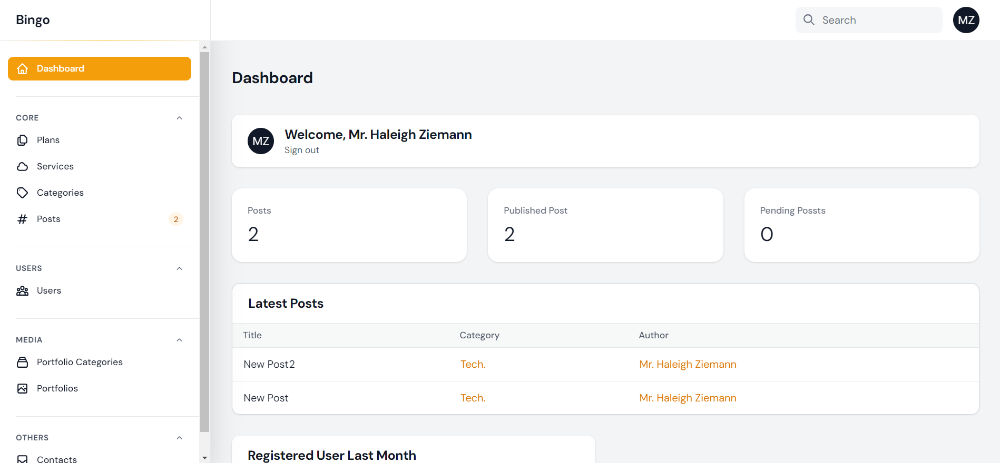

<h1 align="center" style="font-size: 40px">Bingo</h1>

# Home 


# Panel


<hr>

## Config
- Goto `.env` File Put Your DB Configuration
```
DB_DATABASE='Your-DB-NAME'
DB_USERNAME='DB-Username'
DB_PASSWORD='DB-Password'
```
- Sign up in `Mailtrip`
- Put Your Mailtrip Configuration

```
MAIL_MAILER='Here'
MAIL_HOST='Here'
MAIL_PORT='Here'
MAIL_USERNAME='Here'
MAIL_PASSWORD='Here'
```
